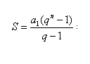

# Teste 2 - Q1 Aritmética Inteira

### Sabendo que uma PG tem a1 e razão q, determine a soma dos 10 primeiros termos dessa progressão. 

#
*O cálculo é dado pela equação abaixo:*

• Entrada:
O programa recebe a1 e q

• Saı́da:
A saı́da consiste de imprimir a soma dos 10 primeiros termos da PG.

#
*Exemplo de Entrada:*
#### 4 
#### 2
#
*Exemplo de Saı́da:*
#### 4092

	